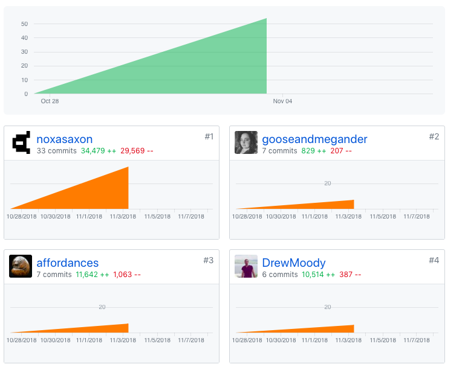
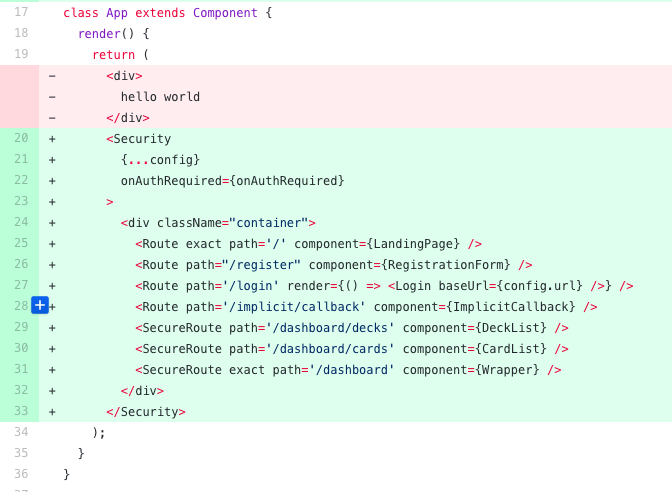
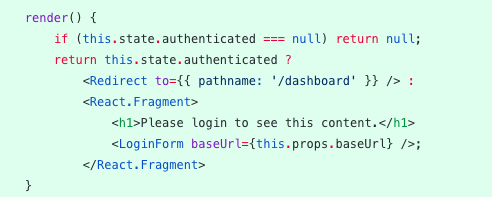
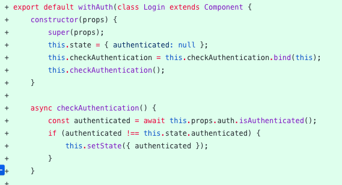

Part 1 - Individual Accomplishments this Week

@gooseandmegander
 
I mostly worked on setting up register and login with Okta this week. Getting it to work locally wasn’t hard, but after we deployed the front and back ends, I’m running into some roadblocks. The way Okta works, in my dashboard, I have to create a new app for each new site we have plus the backends. I have to also change the registration redirect uri from the Okta dashboard as well, but I can only have one, so I’m thinking I’m implementing Okta incorrectly for this project. Or the types of applications Okta serves is not inline with what we are doing. Their documentation and developer forums have also not been very helpful. There’s only one thread on CORS, another problem I’ve had with it. I’ve created a Trusted Origin for each of the sites, and I’ve tested our site url in their testing tool, but I still have problems.

Other than Okta, I spent time working on database models with Drew. Yesterday we put the basic tables in the database so we can start interacting with the database. Lastly, I started on the README yesterday as well.
Tasks Pulled

## Front End
Ticket 1
  - https://github.com/Lambda-School-Labs/Labs8-SpacedRep/pull/3
  - https://trello.com/c/5n3FFUol

## Back End
Ticket 1
  - https://github.com/Lambda-School-Labs/Labs8-SpacedRep/pull/14
  - https://trello.com/c/N19QJc8C

Ticket 2
 - Lambda-School-Labs/Labs8-SpacedRep: Pull Request 6
 - Lambda-School-Labs/Labs8-SpacedRep: Pull Request 7
 - https://trello.com/c/dimaAegI

Ticket 3
 - https://github.com/Lambda-School-Labs/Labs8-SpacedRep/pull/8
 - https://trello.com/c/NU2wKlEt

## Detailed Analysis
Okta register and login users on the frontend #3

_App.js_

The main way Okta interacts with the React app is through a few components which come directly from Okta. The `Security` component is an Okta component that wraps all of the app's routes. Its props hold the config variables, discussed below, and the onAuthRequired function. The onAuthRequired function, when called, directs thea app to the login page.

Another Okta component is `SecureRoute`. `SecureRoute` is used instead of `Route` for routes that require authentication to access. If a user tries to access a protected route without being authenticated, they are redirected to the login page.

_Login.js_

In the Login component, the render method checks to see if the user is already authenticated. If they are, the user is redirected to their dashboard. If they are not, the LoginForm component is rendered.

_Login.js_

Within the Login component, there is a checkAuthentication method which pings Okta via the isAuthenticated method. The response from isAuthenticated becomes the value of the authenticated property on state.

## Milestone Reflections

As a part of your journal entry, write ¼ to ½ a page reflecting on your experiences forming a team. What did you do to help the team solidify as a group? What did you do that you now realize caused friction in this process?

The first week went pretty much how I thought it would. Our biggest challenges seemed to be getting a good workflow going, but we have all been communicative and present, so getting the workflow "working" hasn't been that bad actually. We haven't had any terrible git problems (yet). I'm thankful everyone has been expressive in their opinions and also willing to listen to other members. We did actually talk about an article Punit shared that was meant to help with team-building. It was great to see each member participate. We shared our hopes and fears, which I think it great because we can get an idea of each team member's goals for the labs project. I personally have tried to be participative if not anything else. I've made suggestions, but I always defer to what the group wants. I think compromise in a team setting is so valuable.

I may have caused some friction this week. Mostly, I want to make sure my voice is heard, and that can cause disagreements in itself. I like to have a plan or at least a course of action, which we didn't really have this week. I am most definitely the only person that doesn't mind all of the record keeping we are doing in labs. I love the Trello board and PR template given to us. I like knowing what is going on overall. Even though it took us a while to sort that out, we are settling into a good rhythm.

## Milestone Achievements

Frontend deployment to master: https://srsly.netlify.com

Backend deployment to master:  https://srs-ly.herokuapp.com/

Register and Login on deployed test branch: https://srsly-auth.netlify.com

Login dummy acount info:
- username: pam@gmail.com
- password: 1234abcdABCD
