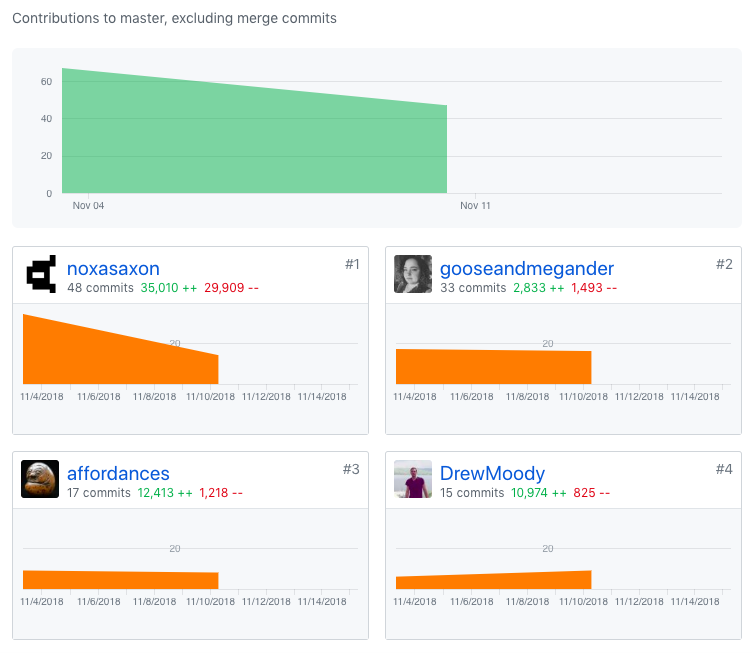
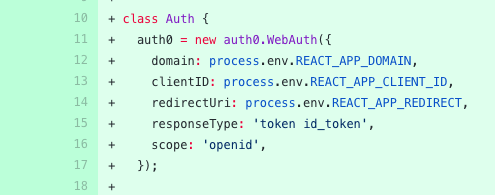
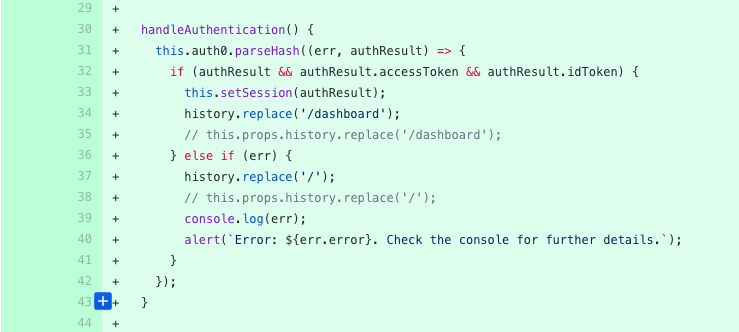
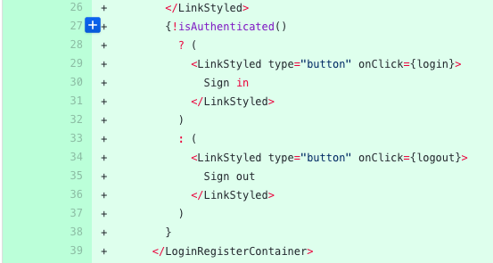
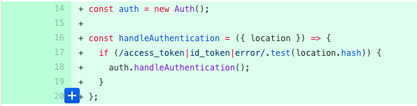
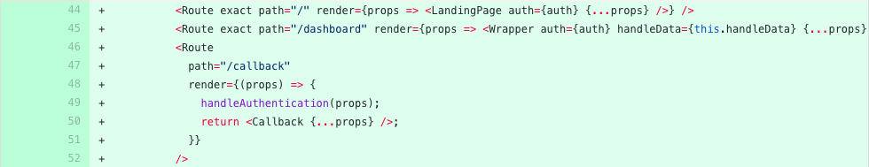
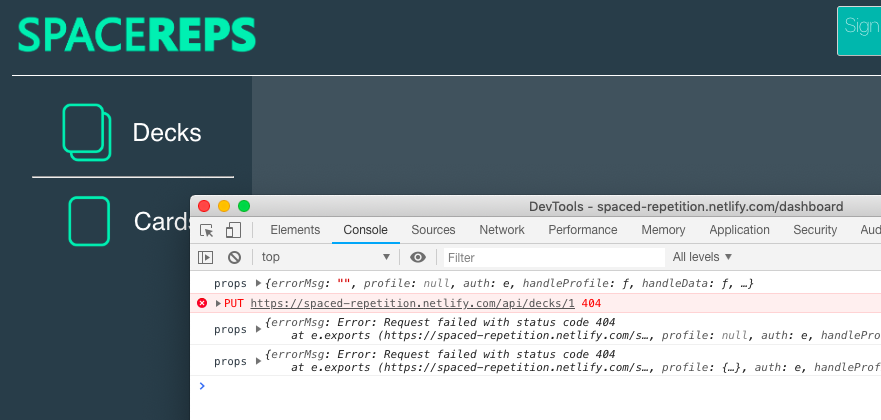

@gooseandmegander

# Part 1 - Individual Accomplishments this Week
## Working as a team to integrate multiple services at a time
**And** _what I did_ :)

The majority of Labs Week 2 was spent hooking up our Stripe API, our SRS algorithm, refactoring our database for client-server connection, and re-implementing auth using Auth0. I thought the week was fairly smooth for so many moving parts happening. What helped us most is our particular mix of services didn't clash or require heavy integration with one antoher. We were able to keep them separate other than their connections to the code base. The two that do largely work together are auth and the database.

Drew and I worked together throughout the week to make sure we were both on the same page. Our main task was deciding how to communicate to the database _which_ user was authenticated and send the correct user data back from the database.

I also worked with Saxon when integrating auth into our production branch. Some of the auth configurations are different between development and production. We were able to setup proper configurations so that the correct environment variables are used. Another "gotcha" was how Travis CI interpreted the auth environment variables. The way Saxon described it, Travis CI working like an in-between state and didn't know which environment variables to use. He was able to configure the right variables directly in the Travis CI UI.

An unfortunate member of our tech stack was murdered this week. A moment of silence for Okta, which I took out back and shot myself. It was already causing problems early on. I met with an actual Okta developer before labs, which is why I was so keen on trying them out. I think their product is great, but it's not great for our needs. Their strength seems to lie in internal authentication, authorization,and SSO. Our needs are much more simple than what their configuration demands. Removing Okta and implementing Auth0 was a smooth process. I almost enjoy working with Auth0. I was frustrated earlier in the week since one of my suggestions burned out so badly, but I am glad I recognized the smoke and put it out ahead of time. Making a bad decision sucks, but we would be worse off if we had continued to push through with Okta.

I'm glad our team recognized the priorities of the week and worked together to make that happen. Had we not discussed priorities, I don't believe we would have made this progress which so nicely sets us up for completing MVP after Thanksgiving break.

#Tasks Pulled
_Some tickets may have changes in both front and back ends._
### Front End
Ticket 1: Create production tenant for auth0
  - [PR](https://github.com/Lambda-School-Labs/Labs8-SpacedRep/pull/32) | [Trello Card](https://trello.com/c/dGBpDArY)

Ticket 2: Get a user's profile from auth0 
 - [PR](https://github.com/Lambda-School-Labs/Labs8-SpacedRep/pull/27) | [Trello Card](https://trello.com/c/fZOlFmsn)

Ticket 3: Migrate to Auth0
- [PR](https://github.com/Lambda-School-Labs/Labs8-SpacedRep/pull/25) | [Trello Card](https://trello.com/c/FRQ19RtP)
- [PR](https://github.com/Lambda-School-Labs/Labs8-SpacedRep/pull/17) | [Trello Card](https://trello.com/c/FRQ19RtP)

### Back End

Ticket 4: Auth <-> DB Connection
- [PR](https://github.com/Lambda-School-Labs/Labs8-SpacedRep/pull/26) | [Trello Card](https://trello.com/c/4iLHZyWw)

## Detailed Analysis
Ticket: Integrates Auth0 Universal Login [#25](https://github.com/Lambda-School-Labs/Labs8-SpacedRep/pull/25/files)

_src/auth/Auth.js_

Setting up auth with Auth0 requires some configuration variables, most importantly the client id and the domain. I created environment variables for those as well as other paths that would change between production and development.

In the img above, the auth0 object creates an authentication service for the app through Auth0 using the client id and domain as well as other options such as the redirect uri, scope, and response type. The most important of the latter three is the redirect uri, which tells Auth0 where to redirect users after they have been authenticated, and the response type, which tells Auth0 what we are expecting to receive back and work with.

An important note from Auth0 is to make sure the version of the auth0-js.js is 9 or greater, else some operations are unsafe now.

_Auth.js_

It's about to get a little hairy, but bear with me. The authentication service we created above belongs to the Auth class in our app. This way we can add methods to the authentication service to _serve_ our authentication needs within the app. In the Auth class, there is a `handleAuthentication` method doing a lot of things for us. It gets called when an authentication event (login) is triggered. When a user logs in successfully, Auth0 redirects the user to the callback uri we defined earlier, but it also sends back tokens and a parameter to set our new tokens' expiration. It does this through the uri itself, and this is when handleAuthentication comes in. It grabs that information from the uri! The breakdown looks something like this:
- user logs in successfully
- Auth0 redirects user to `/callback` with an access token, id token, and expiration paramenter
- handleAuthentication is called to grab the tokens and expiration parameter
`handleAuthentication`'s first job is to grab the info from the uri through Auth0's `parseHash` method. In the case of a successful parsing and the result includes an `accessToken` and `idToken`, those variables are then shipped off to `setSession` to set the tokens in localStorage to allow us to test user authentication throughout the app. The expiration parameter is also shipped off to `setSession` where it is used to determine the expiration time and set in localStorage as well.

_Auth.js_

`isAuthenticated` is another helper method in our authentication service (living in Auth.js) we can use throughout our app to determine what the user sees based on authentication. `isAuthenticated` simply checks to see if our expiration time we set in localStorage is still valid and returns true or false. You can see here we are conditionally displaying either the "Sign in" or "Sign out" button depending if the user is authenticated or not. Having our header conditionally display our buttons is great since we eliminate the need for a public header and a private header. We only need one now!

_App.js_

Lastly, there's a bit of magic happening in App.js to pull this together for us. First, we create an instance of our authentication service, called `auth`. Now we can send auth as a prop to our components so they will have access to `isAuthenticated`, `login`, `logout`, etc. You'll also notice _another_ `handleAuthentication` function. This one is not the same as the on in Auth.js, but it does call `auth`'s handleAuthentication method. That's where it gets a little hairy. The purpose of this "pre-auth-service-handleAuthentication" function is to check the uri hash for the existence of the access token and id token or an error. If the hash at least has those, then auth.handleAuthentication is called and the actual parsing into variables happens. `/callback` is where the hash parsing needs to happen, so we stick our App.js handleAuthentication function in its route to initiate the parsing and token grabbing process.

Beyond that, the rest is the app handling the validity of the user by checking their token's expiration.

## Milestone Achievements

- Auth works: Won't you sign into our app? https://spaced-repetition.netlify.com/
- Stripe works: cannot prove Stripe is integrated into production
- SRS Algorithm works: cannot prove the algorithm is integrated into production
- Frontend and backend communicate:

