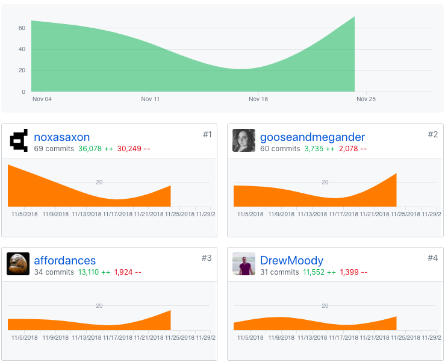
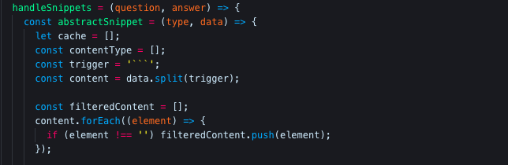
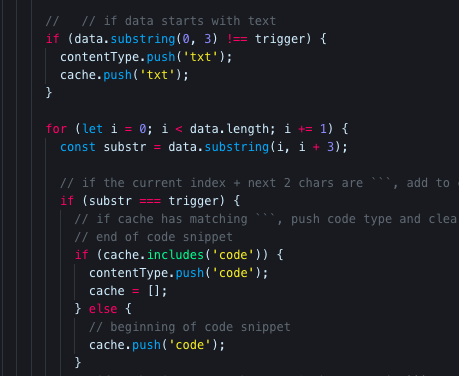
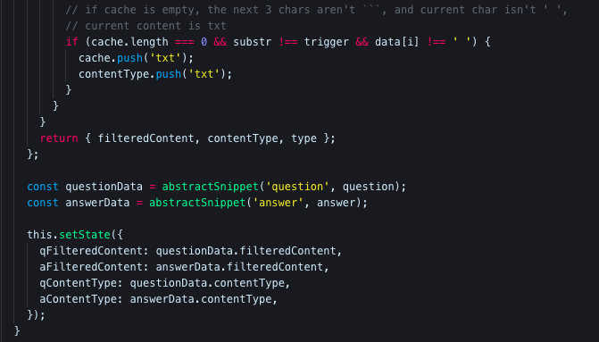

@gooseandmegander

# Whiteboarding video

[Whiteboarding with Patrick Thompson](https://youtu.be/DaYIJNi3OSY)

# Part 1 - Individual Accomplishments this Week
<!-- Provide a paragraph (5-8 sentences) summarizing the work you did this week, the challenges you faced, the tools you used, and your accomplishments -->
I mainly worked on two larger tasks this week, the training deck functionality and the cardlist view. Oddly enough, I felt like a lot of my time and energy this week was spent evaluating our progress and divvying out tasks for my other team members, and that is also where most of the week's challenges stem. There were a few times where I or Keith would assign a task to someone, and they did something else entirely different. This caused some of our bottleneck problems to get worse to the point where we were scrambling Thursday (and today) to get MVP.

One thing I am happy about this week is the work I put out. I was stuck on the algorithm for the deck training mode for a whole day. I think it works well, but I'm sure it could be better. Integrating Highlight.js was not the hard part, like I thought it would be. The hard part was creating the algorithm to separate code snippets from text. Our team decided not to have a code snippet field in our card table, but to have the front end abstract the code from the question and answer fields. It was more work, but I think users can appreciate the feature more as it is now.

# Tasks Pulled

## Front End
Ticket 1
  - https://github.com/Lambda-School-Labs/Labs8-SpacedRep/pull/62
  - https://trello.com/c/aOYViyk2

Ticket 2
  - https://github.com/Lambda-School-Labs/Labs8-SpacedRep/pull/70
  - https://trello.com/c/trT0CpgF

Ticket 3
 - https://github.com/Lambda-School-Labs/Labs8-SpacedRep/pull/63
 - https://trello.com/c/JMYaeUh5

Ticket 4
 - https://github.com/Lambda-School-Labs/Labs8-SpacedRep/pull/41
 - https://trello.com/c/DBB0jXOP

Ticket 5
 - https://github.com/Lambda-School-Labs/Labs8-SpacedRep/pull/46
 - https://trello.com/c/tVrlRB9W

Ticket 6
 - https://github.com/Lambda-School-Labs/Labs8-SpacedRep/pull/44
 - https://trello.com/c/CZtbikEb

Ticket 7
 - https://github.com/Lambda-School-Labs/Labs8-SpacedRep/pull/42
 - https://trello.com/c/elCrGqTU

## Back End


Ticket 8
 - https://github.com/Lambda-School-Labs/Labs8-SpacedRep/pull/43
 - https://trello.com/c/qipmmOOt

## Detailed Analysis
[Sets up deck training capability from DeckList view #41](https://github.com/Lambda-School-Labs/Labs8-SpacedRep/pull/41)


_Card.js_

The topic of my detailed analysis is the algorithm I created handling separating the code snippets from text. The bulk of `handleSnippets` is actually another function, `abstractSnippet`, which does most of the heavy lifting. `handleSnippets` takes in the card's `question` and `answer` as inputs and returns an object with 2 array values (ignore the `type` property here, it is a remnant I forgot to remove). Each array holds a puzzle piece essentially - a piece of content and its type. I don't know at what point I decided to try this approach, but it seems to be working well so far!

The first four variables declared are the cache, contentType, trigger, and content:
- cache: Aids in keeping track of what type of content (text or code) is being processed at any point in time.
- contentType: Is it text or is it code? An array that holds the order of the text/code sequence using the strings 'txt' and 'code'.
- trigger: This string is what the algorithm looks for to determine if a code snippet is beginning or ending. We chose `'```'`, but it could be anything.
- content: The companion array to contentType; it holds the order of the text content and code content using strings split by `Array.prototype.split('```')`.

Below those declarations is code that cleans up the formatting of the content array. I found the array would have `''` elements either at the beginning or ending, so I filtered them out to reduce bugs. At this point, that is all that is done to content. It is ready to be returned!



_Card.js_

This second part starts with a conditional flow. Basically, if the question or answer does not start with `'```'`, then the sequence does not start with code.

Before this, the algorithm hasn't started iterating over the code. The Q & A string arguments must be iterated over at least once. Immediately I made a variable to hold a substring which gathers the current character being processed in the iteration and the next two for a total of three characters. The purpose of this substring is to aid in checking for the `'```'` in the code. And the first control flow inside the for loop is testing whether the current substring is equal to the trigger. If it matches, then either a code snippet is starting or ending. `if (cache.includes('code'))` pushes 'code' into the contentType array and clears the cache since already having 'code' in the cache means a code snippet is currently being processed. Otherwise, a code snippet is beginning and is indicated by pushing 'code' to the cache.


_Card.js_

The next control uses the process of elimination to _deduce_ whether the current content is text. If the cache is empty, that means a code snippet or text is not currently being parsed. Right after a code snippet has ended is a use case for this. Another check is to see if the next characters are our beloved `'```'`, and lastly, the current character cannot count towards text content if it is a space. A use case for this is when two code snippets are next to each other divided by a space.

Once the loop is finished, contentType should hold the correct order of each type of content. The function returns the 2 arrays. I think this function could definitely use more work to catch possible bugs. I would maybe check to see if the lengths match before returning.

Lastly, ...for sure this time, The last lines of code call `abstractSnippet` for question and answer respectively, and the returned data is set in the component state to be displayed in a card.

We've already started refactoring _where_ this algorithm is. I had problems with props while I was writing it, so we decided to move it up to the parent component and pass the formatted data to the child component. This worked much better and cleared up data flow problems.

## Milestone Reflections

Honestly, this has been the hardest part of the entire project. We all want the project to be good, but keeping a team on track is hard! I've been appointed the Trello Queen as I'm the most organized of the group. Organizationally speaking, divvying out the tasks isn't as hard as the social aspect of divvying them out. As I said earlier in my post, I divvied out tasks that never seemed to get done. I would DM people asking about their progress, and their replies were vague. When I try to Sherlock Holmes what they're doing, sometimes their responses were along the lines of, "We talked about this yesterday. Don't you remember?" It's very frustrating to keep an eye on the status of tasks with such responses.

Another difficulty of forming a cohesive product this week has been dealing with everyone's different ideas of what it _should_ look like, _should_ function like, what counts as a complete feature, what they think is better, etc. I haven't slept yet because I was working on a wireframe view that had not been started at all because the other members didn't like it and didn't think it was necessary. This is also one of those tasks I've been asking about all week.

The best way I could think of overcomming these challenges this week is to simply do the best I can and keep trying. I kept divvying out tasks and kept asking about progress. I noticed we are more productive when we meet in zooms more frequently, so everytime someone wants to group zoom, I say yes to meeting. I noticed Saxon and I seem to communicate better one-on-one rather than in big groups, so I check in with him through DM periodically. It worked really well for us yesterday. Approaching Gabe in groups seems to work well. 


## Milestone Achievements

Trello cards with Balsamiq wireframe checklists:
- [Landing Page](https://trello.com/c/YV3bLdPf)
  - https://spaced-repetition.netlify.com
- [DeckList](https://trello.com/c/yDN5XPjR)
  - https://spaced-repetition.netlify.com/dashboard/add-deck
- [Edit Modal](https://trello.com/c/Y0ixM55A)
  - n/a
- [Billing](https://trello.com/c/Vnv7vZFj)
  - https://spaced-repetition.netlify.com/dashboard/billing
- [CardList](https://trello.com/c/6HvqXo9P)
  - not on master yet
- [Card Modal](https://trello.com/c/VpKhOOUh)
  - only in deck training: - https://spaced-repetition.netlify.com/dashboard/decks/8/train
