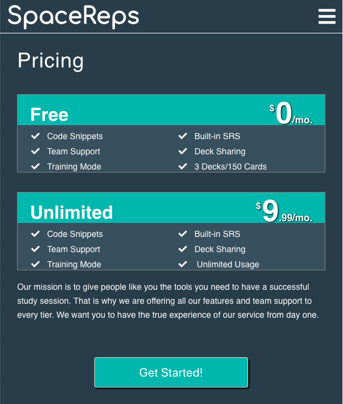

# Individual Accomplishments this Week


@gooseandmegander

## Whitboarding Videos

[Part 1: Michael Agard interviewing me](https://youtu.be/kzO8bs88bTE)

[Part 2: Me interviewing Michael Agard](https://youtu.be/TgdMOCvmaqk)

## What did I do this week?

This week is a blur.


My main task this week became working on the landing page, which still isn't complete. I took a break from it Tuesday, I think, and worked on the headers and sidebar. The headers are responsive and conditionally display sign in/out and a link back to a user's dashboard. The pricing page on the landing page is done. I'm sure there are still tweaks that need to be made. The landing page above-the-fold header needs work. The jumbotron image expands past the app container as well as a few other minor UI bugs.

I was very frustrated this week, mostly because I wasn't moving fast enough with my code. I should be done with the landing page by now. Our app needs tweaks in other places as well. I think I reached some level of burnout this week. I didn't have any progress on Monday. Nothing to show for that day. It was awful, and it's not that I wasn't trying.

I broke through that wall later this week. While I was rebuilding out the sidebar, a constant block was the sidebar wouldn't stay fixed and the child route rendered wouldn't cover the entire page. It was so frustrating! I learned `display: fixed` cannot be used on an html element with `display: flex` on its parent, so I made progress there. The other problem I ran into, which I had when I was making my Lambda Notes App, was making the heights of both the sidebar and child components fill the whole page. I must've forgotten about `height: 100%` because that was what I needed. I didn't realize `height: 100%` must be on _every_ parent element! This also includes `<div id="root"></div>` in index.html! The missing link was there! My UI layouts came together after making those changes. It's also made them much more responsive out of the box.

# Tasks Pulled

## Front End
Ticket 1
  - https://trello.com/c/Y6KebfVT
  - https://github.com/Lambda-School-Labs/Labs8-SpacedRep/pull/92

Ticket 2
- https://trello.com/c/5XxZJgnG
- https://github.com/Lambda-School-Labs/Labs8-SpacedRep/pull/96

Ticket 3
- https://trello.com/c/ViMItKdj
- https://github.com/Lambda-School-Labs/Labs8-SpacedRep/pull/95

Ticket 4
- https://trello.com/c/MVXuJERB
- https://github.com/Lambda-School-Labs/Labs8-SpacedRep/pull/88

## Detailed Analysis
Pricing Page UI

_Pricing.js_


text




```
const Container = styled.section`
width: 100%;
height: 100%;
margin: auto 0;
padding: 5%;
`;

const Content = styled.div`
width: 100%;
height: 100%;

h2 {
  width: 100%;
  height: 10%;
  font-size: 34px;
  letter-spacing: 1px;
}
`;

const Boxes = styled.div`
width: 100%;
height: 90%;
display: flex;
justify-content: space-between;

@media (max-width: 900px) {
  flex-direction: column-reverse;
}
`;


const LeftBox = styled.div`
  width: 30%;
  height: 100%;
  justify-content: space-between;
  display: flex;
  align-items: center;
  
  p {
    line-height: 1.5;
    font-size: 20px;
  }
  
  button {
    font-size: 20px;
    margin-bottom: 20px;
    width: 100%;
    background-color: mediumseagreen;
    box-shadow: 2px 2px 2px black;

    &:hover {
      background-color: lightseagreen;
    }
  }

  @media (max-width: 900px) {
    width: 100%;
    height: 55%;

    button {
      margin-bottom: 0;
      width: 50%;
      align-self: center;
    }
  }
  `;

const PricingCTA = styled.div`
width: 100%;
height: 80%;
display: flex;
flex-direction: column;
justify-content: space-between;

@media (max-width: 900px) {
  height: 100%;
}

@media (max-width: 600px) {
  p {
    font-size: 14px;
    line-height: 1.7;
  }
}
`;

const RightBox = styled.div`
width: 60%;
height: 100%;
display: flex;

@media (max-width: 900px) {
  width: 100%;
}
`;

const CardsContainer = styled.div`
height: 100%;
width: 100%;
display: flex;
justify-content: space-around;
align-items: center;

@media (max-width: 900px) {
  align-items: flex-start
}

@media (max-width: 600px) {
  flex-direction: column;
}
`;

const FreeContainer = styled.div`
border: 1px solid gray;
background-color: #3c4f5d;
width: 45%;
height: 90%;
box-shadow: 6px 6px 15px 1px black;

@media (max-width: 600px) {
  width: 100%;
  height: 40%;
  box-shadow: none;
}
`;

const UnContainer = styled(FreeContainer)`
width: 40%;
height: 80%;
box-shadow: none;
`;

const Header = styled.div`
width: 100%;
height: 30%;

span {
    font-size: 50px;
    
    &::before {
      content: '$';
      position: absolute;
      font-size: 15px;
      margin-left: -10px;
      margin-top: 10px;
    }
  }

  @media (max-width: 600px) {
    display: flex;
    justify-content: space-between;
    height: 40%;
    background: lightseagreen;
    padding: 0 4%;
  }
}
`;

const Card = styled.ul`
height: 70%;

@media (max-width: 600px) {
  display: flex;
  height: 60%;
  display: flex;
  height: 60%;
  flex-wrap: wrap;
  justify-content: center;
  font-size: 14px;
}
`;

const Item = styled.li`
height: 16.666%;
text-align: left;
padding-top: 5%;

i {
  padding: 0 5%;
}

@media (max-width: 900px) {
  padding-top: 2%;
}

@media (max-width: 600px) {
  // margin: 0px 2%;
  width: 48%;
}
`;

const Tier = styled.p`
padding-top: 4%;
height: 40%;
font-size: 32px;
font-weight: bold;
text-align: center;
background: lightseagreen;
            
@media (max-width: 900px) {
padding-top: 1%;
font-size: 30px;
}

@media (max-width: 600px) {
  padding-top: 4%;
}
`;

const Price = styled.p`
height: 20%;
padding-top: 8%;
text-shadow: 1px 1px 2px black;
font-weight: bold;
text-align: center;
span {
  font-size: 50px;
  
  &::before {
    content: '$';
    position: absolute;
    font-size: 15px;
    margin-left: -10px;
    margin-top: 10px;
  }
}

@media (max-width: 900px) {
  padding-top: 1%;
}
`;
```


## Milestone Reflections and Achievements

As a part of your journal entry, write ¼ to ½ a page reflecting on your experiences working with a team to make your product look and feel as good as it works under the hood. Describe how the duties of you and your team shifted tasks shifted towards the front end - and debugging the back end to improve UX.

This week was all about polishing the app. For our group, I think it was easier to see what parts of the app needed more work than others. Humans are very visual creatures, so we knew the landing page was a must to get done as well as some tweaks to our UX/UI flow. I personally found reaching out to my group with screenshots of my changes and asking for their thoughts to be a good strategy. We had a general idea of our UI, but that mockup was not a final version in itself, so we all took some creative liberty to our parts of the app, being sure to continue using the same color palette already present in the app. There are definitely aspects of the UI I would change, but this isn't _my_ project, it's _our team's_ project. We met with Josh Knell and Bri Rios this week to get feedback on our UX/UI. I was surprised by the feedback we received. I thought we were going to have more notes on changes to make than we walked away with after our meetings. Most of our critique was based around spacing, which is not surprising.

Our duties have been mostly on the front end for a good two weeks now. Drew set us up so well, we haven't really needed to touch the back end. Our front end tasks are progressively more and more detail-specific and less functionality-based. We are definitely still missing some features, but our focus this week has shifted to making the UI better since a good UI and basic functionality will at least draw in users. Adding our small missing features thereafter will be "new" features for the user. They are none the wiser! Some of our debugging has come from styling. Our styling practices could be more streamlined. I didn't realize before how much differently people can approach styling architecture and debugging. I might add in/refactor styling and a few PRs later someone else has changed it in some small way or reverted it back. I can see where having a dedicated person(s) working on UX/UI styling would be more efficient than having random team members adding in their approach to styling architecture.

As a group, provide documentation of your progress and remaining tasks:

Remaining Tasks:

*Josh UI notes*
- don’t center "missed it" and  "got it"
- for training modal : 100vh 100vw
- no margin for modal container
- add cancel button top of training
- DECK: ~line up tags left margin with buttton and title~
  - Line up due date with bottom of button~
- SIDEBAR: no gutter for responsiveness
- Billing: make the credit card look very legit

*pick an input style and stick with it*
- change "lemme think about it" to "No Thanks"
- modal for accepted
- CardsList: make it a modal for edit and add
  - make left side 2px bigger (title)
  - make title bigger by .5rem or 2px
- Card: remove edit drop shadow ( make it a subtle black?) vs big grey shadow
- black border

- DeckList: spacing between edit and bottom of edit deck form
- fix spilling out of container

- mobile ready

- optimize the background image (squoosh)~
- resave and downsample it~

*Bri UI notes*
LandingPage:
- center padding of landing page things
- sign up needs to be easier to see
- move cta buttons up and bigger
- train deck- more padding between elements
- ~bold actual question~
- ~move red X up and right~
- more spacing in show answer section
- highlight answer and bold it
- Cards: move question under question
- unbold question, bold "what is react"
- sidebar labels and icons smaller for more padding
- button hover: shading not color
- make the red stand out more
- make duedate more prominent, maybe in a box in bottom right corner

*Brian Notes*
- remove SignUp on landing
- addDeck 6 lines for textareas for question and answer